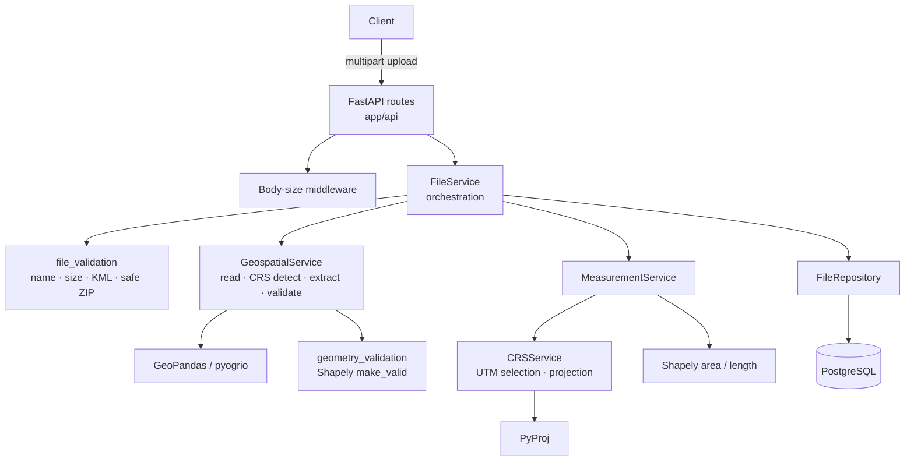

# Geospatial File Measurement API

A production-ready REST API built with **FastAPI**, **GeoPandas**, **Shapely**, **PyProj**, **PostgreSQL**, **SQLAlchemy 2.0**, and **Alembic**. It accepts **KML** files and **ZIP-packaged Shapefiles**, extracts geospatial features, handles coordinate reference systems (CRS) accurately, and calculates per-feature **area (m²)** and **length (m)** measurements without ever measuring geographic coordinates in degrees.

---

## Overview

Geospatial files commonly store coordinates as latitude/longitude in geographic degrees (e.g., `EPSG:4326`). Calling standard geometry area methods directly on degree coordinates produces square degrees—an invalid metric for real-world measurements.

This API prevents degree-based measurements by detecting the source CRS and dynamically transforming geographic geometries into their appropriate local **UTM zone (Universal Transverse Mercator)** prior to measurement. All polygon areas are returned in **square metres (m²)**, line lengths in **metres (m)**, and point geometries are safely handled without measurement.

---

## Features

- **File Upload Support**: Accepts `.kml` and `.zip` (Shapefiles containing `.shp`, `.shx`, `.dbf`, `.prj`).
- **Dynamic CRS Transformation**: Automatic CRS detection, re-projecting geographic coordinates to local UTM zones per feature.
- **Metric Measurements**: Polygon area (`m²`), LineString length (`m`), and unmeasured Points (`None`).
- **Geometry Validation & Repair**: Validates geometries using `shapely.make_valid` without dropping area (avoiding lossy `buffer(0)` approaches).
- **Graceful Error Handling**: Per-feature status tracking (`OK`, `REPAIRED`, `NULL_GEOMETRY`, `EMPTY_GEOMETRY`, `INVALID_GEOMETRY`, `UNSUPPORTED_GEOMETRY`, `TRANSFORM_ERROR`). A single invalid feature never fails the whole file upload.
- **Security & Upload Protection**: Streamed upload size limits, zip-bomb protection, XML entity (XXE) hardening, path-traversal prevention, and symlink rejection.
- **PostgreSQL Persistence**: Fully migrated database schema (`files` and `features` tables) with JSONB attribute storage.
- **Docker Ready**: Complete Docker & Docker Compose setup with health checks and auto-migrations.
- **Comprehensive Test Suite**: 113 unit and integration tests passing cleanly.

---

## Architecture



---

## Project Structure

```
.
├── app/
│   ├── api/
│   │   ├── deps.py              # Dependency injection helpers
│   │   ├── errors.py            # Global exception handlers & JSON error response format
│   │   ├── middleware.py        # Streaming body-size limit middleware
│   │   └── routes/
│   │       ├── files.py         # POST /api/files/, GET /api/files/{id}/, GET /api/files/{id}/measurements/
│   │       └── health.py        # GET /health, GET /ready probes
│   ├── core/
│   │   ├── config.py            # Application settings (Pydantic BaseSettings)
│   │   ├── enums.py             # Domain enumerations (FileStatus, FeatureStatus, etc.)
│   │   ├── exceptions.py        # Domain exception classes
│   │   └── logging.py          # Structured JSON logging configuration
│   ├── db/
│   │   ├── database.py          # SQLAlchemy engine & session factory
│   │   ├── models.py            # FileRecord & FeatureRecord ORM models
│   │   └── repositories.py      # Database access abstraction layer
│   ├── schemas/
│   │   ├── error.py             # Error response schemas
│   │   ├── file.py              # File upload & detail response schemas
│   │   └── measurement.py       # Measurement item & list response schemas
│   ├── services/
│   │   ├── crs_service.py       # CRS classification & UTM projection strategy
│   │   ├── file_service.py      # File upload orchestration & database persistence
│   │   ├── geometry_validation.py # Shapely geometry validation & make_valid repair
│   │   ├── geospatial_service.py # GeoPandas/pyogrio reading & attribute extraction
│   │   ├── measurement_service.py# Planar area and length measurement service
│   │   ├── types.py             # DTO dataclasses
│   │   └── utm.py               # Pure-Numpy UTM EPSG zone calculation
│   ├── utils/
│   │   └── file_validation.py   # Security vetting for uploads, KML parsing & ZIP extraction
│   └── main.py                  # FastAPI application entry point & factory
├── alembic/                     # Database migration scripts
│   └── versions/0001_initial_schema.py
├── sample_data/                 # Sample KML and Shapefile ZIP test files
├── tests/                       # Pytest test suite (113 passing tests)
├── Dockerfile                   # Production container definition
├── docker-compose.yml           # Local multi-container development configuration
├── Makefile                     # Developer command shortcuts
├── pyproject.toml               # Project metadata & tool configuration
├── requirements.txt             # Primary runtime dependencies
├── requirements-dev.txt         # Development & testing dependencies
└── requirements.lock            # Exact pinned dependency environment
```

---

## Processing Flow

```
Upload → Validate Security → Extract Archive → Detect CRS → Extract Features → Repair Geometries → Group by UTM Zone → Project & Compute → Persist DB → Return API Response
```

1. **Upload Validation**: Extension check (`.kml` or `.zip`), streamed content size cap check.
2. **Format Inspection**:
   - **KML**: Validated against XML rules (XXE safe, no DOCTYPEs allowed).
   - **Shapefile ZIP**: Safe extraction checking for single `.shp`, required `.shx` & `.dbf` components, valid `.shp` header magic number, and anti-path-traversal rules.
3. **CRS Detection**: Reads source CRS. Missing `.prj` on Shapefiles results in controlled `422 CRS_MISSING` failure. KML defaults to `EPSG:4326` per specification.
4. **Feature & Geometry Extraction**: Reads features and cleans attribute properties into JSONB-compatible structures.
5. **Geometry Repair**: Validates geometries using `shapely.make_valid`. Invalid geometries are repaired or flagged with per-feature error statuses.
6. **UTM Projection & Measurement**:
   - Geometries with geographic CRS are assigned a local UTM zone using `representative_point()`.
   - Polygons are measured for area (`m²`), LineStrings for length (`m`), and Points remain unmeasured (`None`).
7. **Database Persistence**: File record updated to `COMPLETED` and feature measurement results bulk-inserted inside a single database transaction.

---

## CRS Strategy

| Source CRS Type | System Action |
|---|---|
| **Missing (`.prj` absent)** | **Rejected** (`HTTP 422 CRS_MISSING`). Missing projection info is never guessed. |
| **KML File** | Treated as `EPSG:4326` (WGS84) per the OGC KML standard specification. |
| **Invalid / Unparsable** | **Rejected** (`HTTP 422 CRS_INVALID`). |
| **Geographic (e.g. EPSG:4326)** | Converted per-feature to the optimal **UTM Zone projected CRS** before measuring. |
| **Projected (Metric)** | Measured directly without transformation. |
| **Projected (Non-metric / Mercator)** | Web Mercator (`EPSG:3857`) and foot-based projections are re-projected to local UTM to prevent scale distortion. |

---

## Supported File Formats

1. **KML (`.kml`)**: Standard Keyhole Markup Language XML files containing Placemarks with Polygon, LineString, Point, or Multi-geometry elements.
2. **Shapefile Archive (`.zip`)**: A ZIP compressed archive containing a single Shapefile set (`.shp`, `.shx`, `.dbf`, and `.prj`).

---

## Measurement Rules

- **Polygon / MultiPolygon**: Computed area in **square metres (`m²`)**, rounded to 4 decimal places.
- **LineString / MultiLineString**: Computed 2D planar length in **metres (`m`)**, rounded to 4 decimal places.
- **Point / MultiPoint**: No length or area computed (`measurement_type: null`, `value: null`, `unit: null`, `status: OK`).
- **Invalid / Empty / Null Geometries**: Detailed per-feature status set (`NULL_GEOMETRY`, `EMPTY_GEOMETRY`, `INVALID_GEOMETRY`, `UNSUPPORTED_GEOMETRY`, `TRANSFORM_ERROR`).

---

## API Endpoints

| Method | Endpoint | Description |
|---|---|---|
| `POST` | `/api/files/` | Upload and process a `.kml` or `.zip` Shapefile. |
| `GET` | `/api/files/{id}/` | Retrieve file status and processing metadata. |
| `GET` | `/api/files/{id}/measurements/` | Retrieve feature measurement results (supports `include_properties`, `limit`, `offset`). |
| `GET` | `/health` | Server health and PostgreSQL connectivity probe. |
| `GET` | `/ready` | Server readiness probe verifying database migration status. |
| `GET` | `/docs` | Interactive Swagger UI API documentation. |
| `GET` | `/redoc` | Interactive ReDoc API documentation. |

---

## Example Requests

### Upload KML File
```bash
curl -X POST "http://localhost:8000/api/files/" \
  -H "accept: application/json" \
  -H "Content-Type: multipart/form-data" \
  -F "file=@sample_data/mixed.kml"
```

### Upload Shapefile ZIP
```bash
curl -X POST "http://localhost:8000/api/files/" \
  -H "accept: application/json" \
  -H "Content-Type: multipart/form-data" \
  -F "file=@sample_data/polygons_shapefile.zip"
```

### Retrieve File Metadata
```bash
curl -X GET "http://localhost:8000/api/files/d5faabb1-90ee-41ba-8998-9f0bb295abe4/"
```

### Retrieve Measurements
```bash
curl -X GET "http://localhost:8000/api/files/d5faabb1-90ee-41ba-8998-9f0bb295abe4/measurements/?include_properties=true"
```

---

## Example Responses

### Upload Response (`POST /api/files/`) — HTTP 201
```json
{
  "id": "d5faabb1-90ee-41ba-8998-9f0bb295abe4",
  "filename": "mixed.kml",
  "feature_count": 3,
  "crs": "EPSG:4326",
  "status": "COMPLETED"
}
```

### Measurements Response (`GET /api/files/{id}/measurements/`) — HTTP 200
```json
{
  "file_id": "d5faabb1-90ee-41ba-8998-9f0bb295abe4",
  "total": 3,
  "measurements": [
    {
      "feature_id": 0,
      "geometry_type": "Polygon",
      "measurement_type": "area",
      "value": 12016.9702,
      "unit": "m²",
      "status": "OK",
      "error_message": null,
      "properties": {
        "Name": "Plot A"
      }
    },
    {
      "feature_id": 1,
      "geometry_type": "LineString",
      "measurement_type": "length",
      "value": 534.1495,
      "unit": "m",
      "status": "OK",
      "error_message": null,
      "properties": {
        "Name": "Path B"
      }
    },
    {
      "feature_id": 2,
      "geometry_type": "Point",
      "measurement_type": null,
      "value": null,
      "unit": null,
      "status": "OK",
      "error_message": null,
      "properties": {
        "Name": "Marker C"
      }
    }
  ]
}
```

---

## Error Handling

Errors follow a structured JSON response pattern:
```json
{
  "detail": {
    "code": "CRS_MISSING",
    "message": "No coordinate reference system found (the Shapefile has no .prj or it is empty). Measurements are refused rather than guessed."
  }
}
```

Common error codes:
- `400 UNSUPPORTED_FILE_TYPE`: Extension is not `.kml` or `.zip`.
- `400 MALFORMED_KML`: Invalid XML or root element not `<kml>`.
- `400 INVALID_ZIP` / `UNSAFE_ZIP`: Corrupted archive, path traversal entry (`..`), or zip bomb.
- `400 INVALID_SHAPEFILE`: Missing `.shp`, `.shx`, or `.dbf` components.
- `413 PAYLOAD_TOO_LARGE`: Upload exceeds maximum size limit (default 25 MiB).
- `422 CRS_MISSING` / `CRS_INVALID`: Missing `.prj` file or unparseable CRS definition.
- `404 FILE_NOT_FOUND`: Non-existent file UUID.

---

## Security

- **Streaming Upload Guard**: Enforces streaming size checks to prevent memory exhaustion attacks.
- **XXE Prevention**: KML files are parsed using `lxml` with external DTD loading and entity resolution explicitly disabled.
- **Safe ZIP Extraction**: Archives are sanitized up-front to prevent Zip Slip (`..` path traversal), symlink exploitation, absolute path creation, and zip bomb decompression bombs.
- **Sanitized DB Inputs**: Strips NUL (`\x00`) characters and caps individual string attributes before storing into PostgreSQL JSONB.
- **Zero Information Leakage**: Prevents internal Python tracebacks or raw database errors from leaking in API responses.

---

## Database

Managed with **PostgreSQL** and **Alembic** schema migrations (`alembic/versions/0001_initial_schema.py`).

- **`files` table**: Primary file record, status tracking (`PENDING`, `PROCESSING`, `COMPLETED`, `FAILED`), error tracking, and timing metrics.
- **`features` table**: Foreign key relationship to `files(id)` with `ON DELETE CASCADE`, storing `feature_index`, `geometry_type`, `properties` (JSONB), `measurement_type`, `measurement_value`, `measurement_unit`, and per-feature `processing_status`.

---

## Local Setup

### Prerequisites
- Python 3.11+
- PostgreSQL 14+

### Setup Instructions

1. **Clone Repository & Set Up Virtual Environment**:
   ```bash
   git clone https://github.com/ksuchirreddy/MapMetric.git
   cd MapMetric
   python3 -m venv .venv
   source .venv/bin/activate
   ```

2. **Install Dependencies**:
   ```bash
   pip install -r requirements-dev.txt
   ```

3. **Database Configuration**:
   Start local PostgreSQL and configure credentials:
   ```bash
   cp .env.example .env
   # Ensure DATABASE_URL in .env matches your local PostgreSQL instance
   ```

4. **Run Migrations**:
   ```bash
   alembic upgrade head
   ```

5. **Start API Server**:
   ```bash
   uvicorn app.main:app --host 0.0.0.0 --port 8000
   ```
   Access Swagger documentation at [http://localhost:8000/docs](http://localhost:8000/docs).

---

## Docker Setup

Run the full system (PostgreSQL + FastAPI server) with a single command:

```bash
docker compose up --build
```

The setup automatically waits for PostgreSQL to become healthy, executes database migrations, and exposes the API on `http://localhost:8000`.

To tear down:
```bash
docker compose down -v
```

---

## Testing

Run the complete pytest test suite:

```bash
pytest -q
```

Coverage report:
```bash
pytest --cov=app --cov-report=term-missing
```

### Test Suite Summary
- **Total Tests**: 113 passed cleanly.
- **Coverage**:
  - `test_validation.py`: Stream limits, KML XXE, ZIP traversal, symlinks, zip bombs, geometry repairs.
  - `test_crs.py`: UTM zone determination (northern/southern hemisphere, polar UPS, antimeridian wrap), CRS detection, Mercator re-projection.
  - `test_measurements.py`: Polygon area, LineString length, Point handling, multi-geometries, bad-feature isolation.
  - `test_upload.py`: End-to-end HTTP API integration tests for KML & Shapefile uploads, error cases, and health checks.

---

## Design Decisions

1. **Per-feature UTM Zone Selection**: Automatically selects the accurate local UTM zone for each feature based on its `representative_point()`, ensuring precision across multi-zone files.
2. **Non-persisted Geometries**: Geometries are converted to measurements and discarded. Storing heavy raw geometry blobs is avoided to keep database storage lean.
3. **`shapely.make_valid` over `buffer(0)`**: `buffer(0)` can silently sever multi-polygon lobes or collapse features. `make_valid` preserves geometry area and records explicit repair statuses.
4. **Strict Refusal of Missing CRS**: Missing Shapefile `.prj` files result in `422 CRS_MISSING` to avoid returning inaccurate, guessed measurements.
5. **Re-projecting Web Mercator**: `EPSG:3857` (Web Mercator) uses metre units but significantly inflates surface area away from the equator. It is re-projected to UTM for true metric calculations.

---

## Limitations

- **Planar 2D Measurements**: Elevation (`altitude`) coordinates are ignored; measurements represent 2D planar surface metrics.
- **Large Geometry Spanning**: Features spanning multiple UTM zones or crossing the antimeridian are projected using their representative point's UTM zone.
- **Supported Formats**: Accepts `.kml` and Shapefile `.zip` archives. Formats like GeoJSON, KMZ, and GeoPackage are currently out of scope.

---

## Future Scope

- Asynchronous background task execution with task status polling (`202 Accepted`).
- Geodesic measurement fallback (`pyproj.Geod`) for continental-scale geometries.
- Additional format support (GeoJSON, GeoPackage, KMZ).
- Object storage integration (AWS S3 / MinIO) for original file uploads.

---

## Learning

- Understanding scale distortion in Mercator projections (`EPSG:3857`) and why metric units do not inherently guarantee equal-area measurements.
- Hardening archive extraction pipelines against Zip Slip, path traversal, symlink vulnerabilities, and decompression bombs.
- Leveraging `shapely.make_valid` and maintaining per-feature error isolation so that bad geometries do not crash full file imports.
- Structuring geospatial python pipelines with clear separation between domain logic, data persistence, and API controllers.
